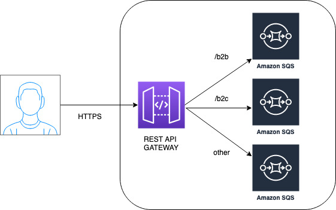

# Terraform migrate and refactor tutorial
This contain some tips and tricks around Terraform migration best practices and refactor code. Do it when you feel comfortable.

# Why we would need to use this?

Some reasons

- Third party module refactor
- Our own code refactor
- Terraform identifier
- Resource identifier

Remember: we are modifying code wrote in Terraform and its state. You don't need this if you can destroy your infra resources or you don't have a terraform state created yet.

# Aliases
Some aliases
```
alias tfi="terraform init"
alias tfp="terraform plan -out plan"
```
# Safety measures
Some safety measures
- Plan what you are doing
- Always have a backup: s3 object versioning, dynamo backups, old plain `cp`
- Use another state backend key

# Project architecture
Diagram of the project architecture



# Terraform 101: simple file
Check `1-local-state/`

## Terraform plan

```
terraform show -json plan
```

# Split into files
Check `1-local-state/split-same-level`
# State file (breif summary)

Every time you run Terraform, it records information about what infrastructure it created in a Terraform state file. By default, when you run Terraform in the folder /foo/bar, Terraform creates the file /foo/bar/terraform.tfstate. This file contains a custom JSON format that records a mapping from the Terraform resources in your configuration files to the representation of those resources in the real world. For example, let’s say your Terraform configuration contained the following:

This is the `main.tf`
```
resource "aws_instance" "example" {
  ami           = "ami-0c55b159cbfafe1f0"
  instance_type = "t2.micro"
}
```

And the corresponding `terraform.tfstate`
```
{
  "version": 4,
  "terraform_version": "0.12.0",
  "serial": 1,
  "lineage": "1f2087f9-4b3c-1b66-65db-8b78faafc6fb",
  "outputs": {},
  "resources": [
    {
      "mode": "managed",
      "type": "aws_instance",
      "name": "example",
      "provider": "provider.aws",
      "instances": [
        {
          "schema_version": 1,
          "attributes": {
            "ami": "ami-0c55b159cbfafe1f0",
            "availability_zone": "us-east-2c",
            "id": "i-00d689a0acc43af0f",
            "instance_state": "running",
            "instance_type": "t2.micro",
            "(...)": "(truncated)"
          }
        }
      ]
    }
  ]
}
```
# Remote state
By default, Terraform stores state locally in a file named terraform.tfstate. When working with Terraform in a team, use of a local file makes Terraform usage complicated because each user must make sure they always have the latest state data before running Terraform and make sure that nobody else runs Terraform at the same time.

With remote state, Terraform writes the state data to a remote data store, which can then be shared between all members of a team. Terraform supports storing state in Terraform Cloud, HashiCorp Consul, Amazon S3, Azure Blob Storage, Google Cloud Storage, Alibaba Cloud OSS, and more.

Remote state is implemented by a backend, which you can configure in your configuration's root module.

> Talk about s3 state file
> Talk about Dynamo Table and lockID

Changes to backend configurations require reinitialization. This allows Terraform to set up the new configuration, copy existing state, etc. Please run "terraform init" with either the "-reconfigure" or "-migrate-state" flags to use the current configuration.

## Remote lock
Check for lock id base on the md5 of the state content file.
## Remote state Push & Pull
```
https://www.terraform.io/docs/cli/commands/state/push.html
-- terraform state pull
-- terraform state push
```

Check `2-remote-state/`
# Split into folders (aka. modules)

Check `3-modules`
```
terraform state mv
terraform state list
terraform state list module.elb
terraform state list -id=sg-1234abcd
terraform state show 'packet_device.worker'

https://www.terraform.io/docs/cli/commands/state/mv.html
terraform state mv [options] SOURCE DESTINATION
```
# Move between modules
Check `3-modules`

# Move between diferent states
Check `4-move-between-states`
# Move between workspaces
Check `5-workspaces`

# Terraform Import
```
terraform import
```
# Terraform version 1.1.0: moved blocks
Moved blocks for refactoring within modules: Module authors can now record in module source code whenever they've changed the address of a resource or resource instance, and then during planning Terraform will automatically migrate existing objects in the state to new addresses.

This therefore avoids the need for module users to manually run terraform state mv after upgrading to a newer module version, as long as the change is expressible as static configuration. However, terraform state mv remains available for use in more complex migration situations that are not well-suited to declarative configuration.

# What about?
## Multiple objects
for each vs count: https://www.terraform.io/docs/cli/state/resource-addressing.html
### Count
### For

## Ouputs

## Data

# Commands

```
terraform plan -out plan
terraform apply
terraform refresh

terraform import
terraform state
```

# tfmigrate
[tfmigrate](https://github.com/minamijoyo/tfmigrate) A Terraform state migration tool for GitOps.
